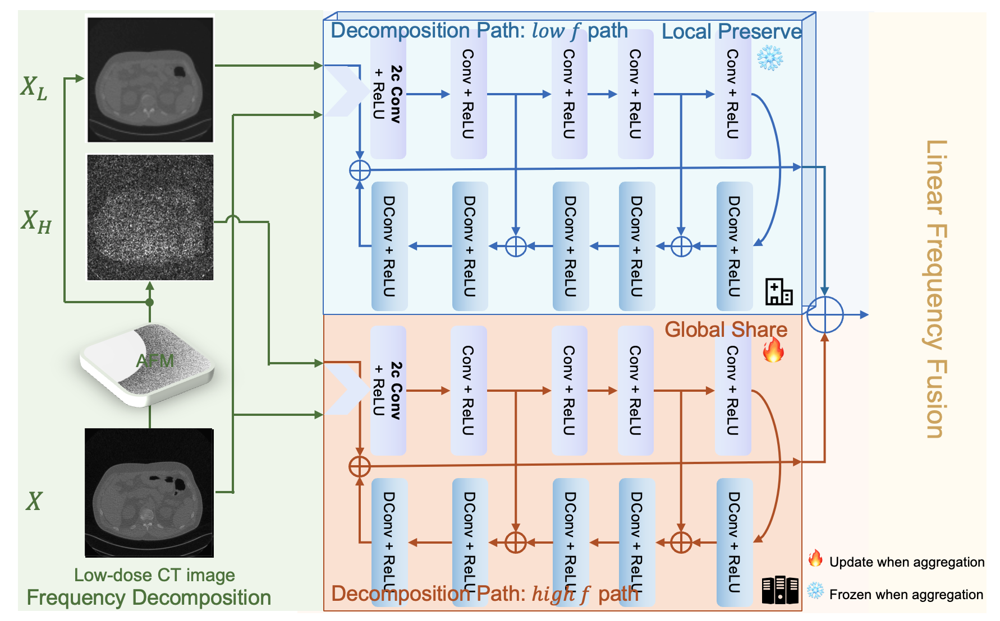

# FedFDD: Federated Learning with Frequency Domain Decomposition for Low-Dose CT Denoising

This is the pytorch implementation of FedFDD in the MIDL paper: [FedFDD: Federated Learning with Frequency Domain Decomposition for Low-Dose CT Denoising](https://openreview.net/pdf?id=Zg0mfl10o2)

The architecture of our model(FedFDD) is shown as below:


Through extensive experiments, we demonstrate that FedFDD can surpass state-of-the-art FL methods as well as both localized and centralized models, especially on challenging LDCT denoising cases.

## Setup

### 1. Create conda environment(Optional)
```
mamba create -n FedFDD -y python=3.8 
mamba activate FedFDD
```

### 2. Install dependecies
Install the required packages **(requirements.txt will be released later.)**
```
pip install -r requirements.txt
```

### 3. Prepare the data
Please contact The Cancer Image Archive (TCIA) team with respect to downloading and using the dataset.

For the preparation of the patient's data before feeding to the network, please refer to `config/pts.yaml` and `config/ldct_loader.py`


## Train and Evaluate

### 1. Train

`python main.py --fed_name=fedfdd`

If you want to do fine-grained experiments, please run `python server/fedfdd.py` with specific args.

### 2. Evaluate

`python test.py --ckpt_path=<your checkpoints file path> --test_model=<expected test model name> `


## Citation

If you find this repo useful, please cite our paper. 
```
@inproceedings{
chen2024fedfdd,
title={Fed{FDD}: Federated Learning with Frequency Domain Decomposition for Low-Dose {CT} Denoising},
author={Xuhang Chen and Zeju Li and Zikun Xu and kaijie Xu and Cheng Ouyang and Chen Qin},
booktitle={Submitted to Medical Imaging with Deep Learning},
year={2024},
url={https://openreview.net/forum?id=Zg0mfl10o2},
note={under review}
}
```

## Contact

If there are any issues, please ask in the GitHub Issue module.

## Acknowledgement

We appreciate the following github repos a lot for their valuable code base:

https://github.com/KarhouTam/FL-bench

https://github.com/SSinyu/RED-CNN
